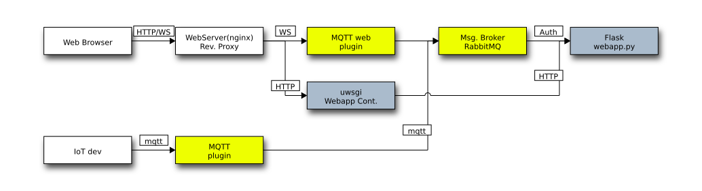

# Docker IoT + Web

# Uso

En el [`Makefile`](./Makefile) se definen las los siguientes targets:

* **up** Crear los contenedores
* **down** Destruir los contenedores
* **open** Abrir el navegador

